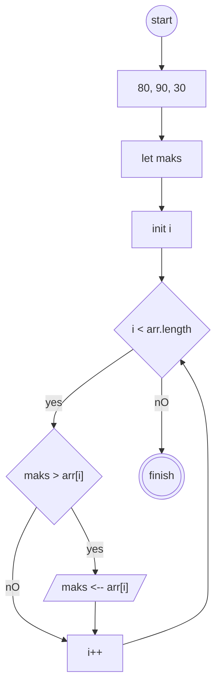

# flowchart min max average

```mermaid
    flowchart TB
    start((start))
    initArr["80, 90, 30"]
    init["init i"]
    init2["let maks"]
    increment["i++"]
    check{"i < arr.length"}
    check2{"maks > arr[i]"}
    result[/"maks <-- arr[i]"/]
    finish(((finish)))

    start --> initArr
    initArr --> init2
    init2 --> init
    init --> check
    check --yes--> check2
    check --nO--> finish
    check2 --yes--> result
    check2 --nO-->increment
    result --> increment
    increment --> check


```